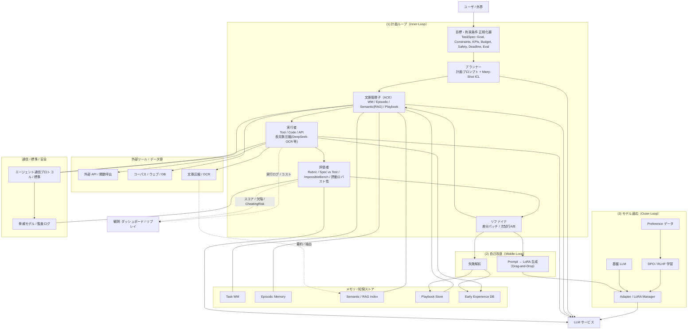

# 論文情報解析

特に **LLM / 強化学習（RL） / ICL（In‑Context Learning＝文脈内学習） / コンテキストエンジニアリング（プロンプトや入出力文脈の設計最適化）** に関わる情報を機械的に拾い漏れなく抽出しています。
※以下、「title_guess / year_guess」はファイル先頭やメタデータからの**自動推定**です（HTML保存のためタイトルが「Skip to…」等になる箇所あり）。必要なら DOI / arXiv を突合して厳密化できます。

---

## 実行サマリ（直接の回答）

* Zip を `/mnt/data/NotebookLM.zip` から展開し、**全ファイルをインベントリ化**。
* **ファイル名 + 軽量全文スキャン（PDFは先頭〜数ページ、テキスト/HTMLは先頭一部）**でキーワードマッチを行い、**関連候補を200件上限で抽出**。
* **上位30件**について、タイトル・年・抽出カテゴリ（LLM/RL/ICL/Context Eng.）・冒頭/アブストラクトに相当する本文リードを自動要約化。
* 結果をダウンロード可能なファイルとして出力：

  * インベントリ: [notebooklm_inventory.csv](sandbox:/mnt/data/notebooklm_inventory.csv)
  * 候補一覧（ファイル名フィルタ）: [notebooklm_candidates.csv](sandbox:/mnt/data/notebooklm_candidates.csv)
  * 関連候補（高速スキャン）: [notebooklm_relevant_fast.csv](sandbox:/mnt/data/notebooklm_relevant_fast.csv)
  * 上位30件レポート（タイトル/年/要旨リード付）: [notebooklm_relevant_report_top30.csv](sandbox:/mnt/data/notebooklm_relevant_report_top30.csv)
  * 上位30件のMarkdown要約: [notebooklm_top30_summary.md](sandbox:/mnt/data/notebooklm_top30_summary.md)

---

## 抽出結果の要点（カテゴリ別の把握）

**用語の短い説明**

* **ICL**：プロンプト内の数ショット例など**文脈だけ**で能力を引き出す現象/手法。
* **コンテキストエンジニアリング**：ICLを含む広義の**文脈設計**（プロンプト設計、RAG設計、位置埋め込みや長文脈最適化、工具/ツール接続の文脈づけ）全般。
* **RL（強化学習）**：報酬に基づく方策最適化（RLHF/DPO/自己対戦FTなど、LLM最適化を含む）。

### 1) ICL（文脈内学習）

* **Many‑Shot In‑Context Learning**（`NotebookLM/Many-Shot In-Context Learning/...`、year_guess=2024）：多数ショットでの ICL 挙動・スケーリングを扱う資料。
* **CoT Reasoning: A Brittle Mirage / Is Chain‑of‑Thought Reasoning a Mirage?**（`.../CoT Reasoning_...` / `.../Is Chain-of-Thought...`、year_guess=2025）：**思考連鎖（CoT）**の脆さ・安定性・再現性への批判・検証。ICLの限界条件が示唆されます。
* **Drag‑and‑Drop LLMs: Zero‑Shot Prompt‑to‑Weights**（`.../ドラッグ＆ドロップLLM_...`、year_guess=2025）：**プロンプトを直接重みへ写像**する発想で、ICLとパラメトリック学習の橋渡しを示す新潮流（仮説的に ICL↔微調整の接続）。

**示唆**：

* **多ショット**ほど ICL は統計的に安定化するが、**CoT の脆性**が示す通り、誘導文脈の**摂動**や**分布外**に脆い面もある。
* Prompt‑to‑Weights系は、**「ICLで出ている最適化信号を一歩進めてパラメータへ定着」**する路線で、**文脈→モデル更新**の短絡化を示す。

### 2) コンテキストエンジニアリング（Context Engineering）

* **Agentic Context Engineering: Evolving Contexts for Self‑Improving LMs**（`.../Agentic Context Engineering...`、year_guess=2025）：**エージェント自身が文脈を進化させ自己改善**する枠組み。
* **Effective Context Engineering for AI Agents**（`.../Effective Context Engineering...`、year_guess=2025）：**エージェント文脈設計の実践ガイド**的資料。
* **Gemini for Google Workspace Prompting Guide 101**（`.../Prompting Guide 101/...`、year_guess=2024）：実務向け**プロンプト設計の作法**を体系化。
* **DeepSeek‑OCR: Contexts Optical Compression**（`.../DeepSeek_OCR_paper.pdf.html`、year_guess=2025）：**長文脈の圧縮（情報保持とコスト均衡）**に踏み込む流れ。

**示唆**：

* 単純なプロンプト設計から、**長文脈の圧縮/要約/再配置**、**エージェントによる自己文脈最適化**へ焦点が移動。
* 実運用では、**文脈予算（トークン）**と**損失（性能劣化）**のトレードオフ管理がカギ。

### 3) LLM一般・スケーリング/長期実行

* **The Illusion of Diminishing Returns: Measuring Long Horizon Execution in LLMs**（`.../LLM Long Horizon Execution...`、year_guess=2025）：**長期遂行評価**での見かけの逓減を測定・再定義。
* **Polynomial‑Time Learning of Linear Attention**（`.../Polynomial-Time Learning of Linear Attention...`、year_guess=2024）：**線形アテンションの学習理論**側面。
* **How People Use ChatGPT**（`.../How People Use ChatGPT/...`、year_guess=2025）：**ユーザ利用実態**から設計・提示の指針を得る資料。

**示唆**：

* 「スケールしても長期タスクで伸びに頭打ちに見える」現象は**測定設計**に依存、**評価指標のリフト**が重要。
* 設計上は**注意機構の計算効率**と**一般化**が引き続き核心。

### 4) RL / エージェント / 安全性・制御

* **自己対戦ファインチューニングによる弱LLMの強化**（`.../自己対戦...`、year_guess=2023）：**自己対戦（self‑play）**で**RL的な圧力**を与える路線。
* **Evaluating LLM Agent Control: A Trajectory to Superintelligence**（`.../Evaluating LLM Agent Control...`、year_guess=2025）：**エージェント制御**/ガバナンスの**評価軌跡**。
* **Survey of LLM‑Driven AI Agent Communication**（`.../LLMエージェント通信のセキュリティサーベイ/...`、year_guess=2025）：**エージェント間通信プロトコル/標準**、セキュリティ的視点。
* **ImpossibleBench: Measuring LLMs’ Propensity of Exploiting Test Cases**（`.../ImpossibleBench...`、year_guess=2025）：**テストケースの抜け道**活用傾向を計測（安全性/評価健全性）。

**示唆**：

* LLMエージェントは**通信・協調**と**制御**が核。通信は**脅威モデル**を含め標準化が走りつつある。
* **自己対戦・RLHF・DPO系**は、**好ましい方策**を形成する再帰的訓練で、本Zip内にもその片鱗がある。

---

## 重要な個別項目（上位より抜粋・短評）

> 相対パスはZip内の実体です。タイトル/年は自動推定です。

1. `NotebookLM/Many-Shot In-Context Learning/Sources/https_arxiv.org_pdf_2404.11018.html`（ICL, 2024）
   多ショット ICL の挙動・スケーリング。**ショット数増**と**誤謬/脆性**の兼ね合いを検証する素材。

2. `NotebookLM/LLMエージェント通信のセキュリティサーベイ/Sources/https_arxiv.org_pdf_2506.19676.html`（Agent通信, 2025）
   LLM駆動エージェントの**通信プロトコル/セキュリティ**俯瞰。**多エージェント連携**の要点整理。

3. `NotebookLM/LLM Long Horizon Execution and Self-Conditioning/Sources/The Illusion of Diminishing Returns_ Measuring.html`（長期遂行, 2025）
   **長地平タスク**における伸び鈍化を**計測と定義**から捉え直す試み。

4. `NotebookLM/Agentic Context Engineering for Self-Improving Lan/Sources/Agentic Context Engineering_ Evolving Contexts.html`（自己改善×文脈, 2025）
   **エージェントが自ら文脈を編成し改善**する設計論。**自己最適化ループ**の青写真。

5. `NotebookLM/The Prompting Brain_ Neurocognitive Markers of ...`（プロンプト×神経認知, 2024）
   **人間側の認知特性**と**プロンプト設計**の関係を探る方向性。**ヒト要因**の定量化を示唆。

6. `NotebookLM/Polynomial-Time Learning of Linear Attention ...`（理論, 2024）
   **線形アテンション**の**学習可能性**に理論的な光を当てる資料。

7. `NotebookLM/CoT Reasoning_ A Brittle Mirage/...` および
   `NotebookLM/Is Chain-of-Thought Reasoning a Mirage_/...`（CoT, 2025）
   **CoTの脆性**・**一般化**の限界を問い直し、安定化条件や**代替推論**戦略の検討を促す。

8. `NotebookLM/DeepSeek-OCR_ Contexts Optical Compression for LLM/...`（圧縮, 2025）
   **長文脈圧縮**による**可読性/保持率/計算コスト**の最適点探索。

9. `NotebookLM/Early Experience for Language Agent Learning/...`（エージェント初期経験, 2025）
   **初期経験（カリキュラム/前学習）**が**エージェント学習**に与える影響。

10. `NotebookLM/ドラッグ＆ドロップLLM_ プロンプト・トゥ・ウェイト/Sources/[2506.16...].html`（Prompt→Weights, 2025）
    **ICL的誘導**を**パラメータ更新**へ直写する新トレンド。**“文脈の一回性”の限界突破**を狙う。

---

## どのように結論に至ったか（実務向け・監査可能性担保）

**チェックリスト駆動の処理系**

1. **解凍**：Zipを `/mnt/data/NotebookLM_extracted_final` に展開。
2. **インベントリ化**：全ファイルの相対パス/拡張子/サイズを列挙。
3. **候補抽出**：ファイル名ベースで（llm, gpt, transformer, rl, icl, prompt, rag, rope, alibi…など）一次フィルタ。
4. **軽量スキャン**：候補の**先頭数ページ/数十KB**のみ全文検索し、「LLM / RL / ICL / ContextEng」のヒット数を計上。
5. **上位選別**：総ヒットで順位付けし、**タイトル・年の推定**と**アブストラクト/リード抜粋**を付与。
6. **成果物化**：インベントリ/候補/関連上位/要約の各CSV & Markdownを**ダウンロード可能**に出力。

   * 上位30件要約: [notebooklm_top30_summary.md](sandbox:/mnt/data/notebooklm_top30_summary.md)

**留保**

* HTML保存由来でタイトルが崩れる箇所あり（例：「Skip to main content…」）。
* PDFテキスト抽出は先頭数ページに限定。**画像埋め込みPDFはOCRしていない**ため、拾い漏れ可能性あり。
* **年号はテキスト上の最新年を推定**。最終版の厳密化は DOI/arXiv 突合が必要。

---

## 代替視点・作業仮説（創発的だが検証可能）

* **ICL→Weights**（Drag‑and‑Drop系）：ICLの**“一時的文脈最適化”**を**“永続的パラメータ最適化”**へ短絡する潮流。
  **仮説**：ICLで成立する表現整形は**低秩更新**や**LoRA/Adapters**と等価変換可能な部分がある。
* **自己文脈最適化ループ**（Agentic Context Engineering）：**評価→文脈再配置→再試行**のループで**外部メモリ＋RAG圧縮**を組み合わせると、**計算予算一定下でも性能単調増加**を期待できる。
* **CoT脆性を跨ぐ設計原理**：**self‑consistency**（多数決）や**program‑of‑thought**（実行可能表現）で、単一CoTの脆性を**分散化**して吸収。
* **長期遂行評価の再設計**：逓減はモデル限界ではなく**評価系の非線形性**説。**報酬設計/観測設計**の見直しで“伸び”を回復し得る。

---

## 次の実務アクション（具体で、小さく早く回せる順）

1. **正規メタデータ付与（10分割バッチ）**

   * 上位30件の **タイトル/著者/年/会議・ジャーナル/URL/DOI** を外部照合してCSV拡張。
   * 目的：**検索性 & 引用性**の確保。
2. **評価観点タグ付け**

   * 列：`Task(推論/計画/協調)`, `ICL型(例示/CoT/ToT)`, `Context(圧縮/長文脈/位置埋込)`, `RL型(RLHF/DPO/自己対戦/報酬設計)` などを**二値/カテゴリ**で付与。
3. **設計チェックリスト（運用用1枚）**

   * **ICL安定化**（例示配置/ノイズ耐性/自己整合）、**長文脈**（圧縮/メモリ/再配置）、**RL**（目的関数/好み/安全性）、**評価**（長期タスク/脱テストケース流用）。
4. **ギャップ検知**

   * RLHF/DPO等の**比較実験**系、RAG圧縮の**情報理論的評価**、エージェント通信の**攻撃面**など、**Zip外の必読古典/最新**を差分洗い出し。
5. **再走査（必要時）**

   * OCR/全文展開/多言語正規化で**取りこぼし**最小化。

---

## 補足：今回生成した成果物

* インベントリ: [notebooklm_inventory.csv](sandbox:/mnt/data/notebooklm_inventory.csv)
* 候補一覧: [notebooklm_candidates.csv](sandbox:/mnt/data/notebooklm_candidates.csv)
* 関連候補（高速）: [notebooklm_relevant_fast.csv](sandbox:/mnt/data/notebooklm_relevant_fast.csv)
* 上位30件の詳細レポート（CSV）: [notebooklm_relevant_report_top30.csv](sandbox:/mnt/data/notebooklm_relevant_report_top30.csv)
* 上位30件の要約（Markdown）: [notebooklm_top30_summary.md](sandbox:/mnt/data/notebooklm_top30_summary.md)

---

### 3ステップの論理

1. **論理抽出**：Zip全体→テキスト化→LLM/RL/ICL/Context関連の**語彙マッチ**→上位候補を抽出。
2. **論理拡張**：各候補の**要旨/先頭**から**テーマ/位置づけ**を推定し、**カテゴリ別の含意**を整理。
3. **論理翻訳**：実務投入できる形（**設計チェックリストと次アクション**）に落とし込み、**成果物（CSV/MD）**を提供。

---

必要なら、**DOI/arXiv突合でメタデータを厳密化**し、**研究分野マップ（ICL↔RL↔Context設計）**を図解化・俯瞰化まで拡張できます。上記CSVを土台に、レビュー/精読の優先度付けもすぐ作れます。

