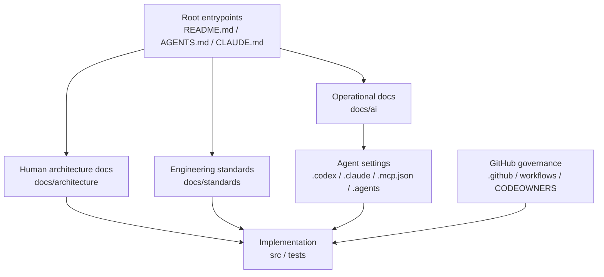

# AIエージェント前提 GitHub テンプレートリポジトリ設計書

- 文書種別: コンセプト・仕様・設計書
- 対象: Codex CLI / Claude Code を中心に AI エージェントを活用する開発チーム
- 適用対象: このテンプレートから生成されるすべての GitHub リポジトリ
- 版: v1.0

---

## 1. 文書の目的

本書は、このテンプレートリポジトリの**設計意図**、**要求仕様**、**ディレクトリ構成の責務分離**、および**運用ルール**を定義する。

このテンプレートは、単なる「初期ファイルの寄せ集め」ではなく、次の状態を実現するための**標準作業基盤**である。

1. 人間の開発者が迷わない
2. Codex CLI / Claude Code が迷わない
3. GitHub の標準機能を最初から自然に使える
4. AI エージェントに必要な指示・設定・権限・知識を、コードや人間向け文書と衝突させずに管理できる
5. 将来の monorepo 化、MCP 追加、skill 追加、CI 増強に耐えられる

本書は、テンプレートを利用して新しいリポジトリを作成する際の**判断基準**でもある。以後、構成変更は本書の原則と整合していなければならない。

---

## 2. 前提と設計思想

### 2.1 前提

本テンプレートは以下を前提とする。

- AI エージェントは、会話だけでなく**ファイル読取・編集・コマンド実行・Git 操作・外部ツール連携**を行う
- AI エージェントは、暗黙知よりも**明示された構造・短い入口・機械可読な規約**を好む
- GitHub のテンプレート repo 機能により、**同じディレクトリ構成・ファイル・ブランチ**を複製して新規 repo を作る
- 運用上は、**共有設定**と**個人設定**、**人間向け文書**と**AI 向け運用契約**、**コード**と**ツール固有設定**を分離した方が保守しやすい

### 2.2 設計原則

本テンプレートは、以下の原則に基づいて構成する。

#### 原則 P-01: Root は入口、詳細は docs

ルート直下の `README.md`、`AGENTS.md`、`CLAUDE.md` は入口に限定する。長大な運用ルール、アーキテクチャ詳細、標準、制約は `docs/` 配下に分離する。

#### 原則 P-02: 人間用と AI 用の責務を分離する

- `README.md` は人間向けの入口
- `docs/architecture/` は設計説明
- `docs/standards/` は実装標準
- `docs/ai/` は AI エージェントの運用契約・MCP 方針・skill の参照先

この分離により、人間向けの可読性と AI 向けの明確性を両立する。

#### 原則 P-03: ツール固有設定は隠しディレクトリに隔離する

AI ツール固有の設定は `.codex/`, `.claude/`, `.agents/`, `.mcp.json` に閉じ込める。アプリケーションコードや通常ドキュメントと混在させない。

#### 原則 P-04: 共有設定と個人設定を分離する

チームで共有すべきものだけをコミットし、個人の試行錯誤や端末依存の設定はコミットしない。

#### 原則 P-05: 安全側デフォルト

sandbox、approval、secret 取扱い、MCP 採用、runner 選択は、利便性よりもまず**事故防止**を優先する。

#### 原則 P-06: repo 自体を source of truth にする

AI エージェントの判断基準は、会話履歴ではなく repo 内の明示情報に置く。口頭で伝えた運用は、必要なら文書化して repo に昇格させる。

#### 原則 P-07: 将来の分割・拡張に備える

テンプレートは small repo でも使え、monorepo にも無理なく拡張できる必要がある。よって、将来サブディレクトリ単位で skill や規約を追加できるように設計する。

---

## 3. スコープ

### 3.1 本テンプレートが解決するもの

- GitHub テンプレート repo の初期骨格
- Codex CLI / Claude Code の初期導入場所
- Issue / PR / CODEOWNERS / workflow / Dependabot の標準化
- AI エージェント向けの入口ファイルと詳細文書の分離
- 共通 CI 検証の最低限の土台
- dev container / Codespaces の開始点

### 3.2 本テンプレートが解決しないもの

- 言語・フレームワーク固有の完成済み build 設定
- 本番インフラ構成
- 完全なセキュリティ統制
- プロダクト固有のアーキテクチャ記述
- 全社ルールの最終形

これらはテンプレートから生成した各 repo で上書き・追加される。

---

## 4. 用語定義

本書では、以下のキーワードを規範用語として使う。

- **MUST**: 必須。守らない場合、このテンプレートの設計意図から逸脱する
- **SHOULD**: 強く推奨。合理的な理由があれば例外可
- **MAY**: 任意。必要に応じて採用可

---

## 5. 全体構成

```text
.
├── .agents/                 # Codex 用 repo-local skills
├── .claude/                 # Claude Code の shared project settings / skills
├── .codex/                  # Codex の repo-scoped config
├── .devcontainer/           # Codespaces / dev container
├── .github/                 # CODEOWNERS, issue/PR templates, workflows, Dependabot
├── docs/
│   ├── ai/                  # AI エージェント向け運用契約・MCP・skill reference
│   ├── architecture/        # 設計意図・境界・重要構造
│   └── standards/           # coding / testing / security standards
├── scripts/ci/              # テンプレート検証・共通CI補助
├── secrets/                 # プレースホルダ。実 secret はコミット禁止
├── src/                     # 実コード
└── tests/                   # テスト
```

### 5.1 構造のレイヤ分離



この構造の要点は、**入口・知識・設定・実装・ガバナンス**を混在させないことである。

---

## 6. ディレクトリ別仕様

## 6.1 ルート直下

| パス | 区分 | 役割 | 運用ルール |
|---|---|---|---|
| `README.md` | 人間向け入口 | リポジトリの目的、使い方、初期 TODO を示す | MUST: 初見の人が 3 分で全体像を把握できる内容にする |
| `AGENTS.md` | Codex / agent 入口 | Codex を含むエージェント向けの短い永続指示 | MUST: 詳細を書きすぎない。詳細は `docs/ai/` に委譲 |
| `CLAUDE.md` | Claude Code 入口 | Claude Code 向けの短い永続指示 | MUST: `AGENTS.md` と競合しない。Claude 固有差分のみ持てる |
| `CONTRIBUTING.md` | 人間向け貢献手順 | issue / PR / 開発手順の最低限 | SHOULD: org-level `.github` と整合させる |
| `SECURITY.md` | 開示窓口 | 脆弱性報告手順 | MUST: 公開 repo の場合は実連絡先へ更新 |
| `.env.example` | 設定雛形 | 必要な環境変数の見本 | MUST: 実 secret を含めない |
| `.mcp.json` | Claude 共有 MCP | Claude Code の project-scoped MCP 定義 | MUST: チーム共有してよいものだけをコミット |
| `.gitignore` | Git 制御 | 個人設定・生成物・secret を除外 | MUST: `.claude/settings.local.json` 等を除外 |
| `.editorconfig` | 編集統一 | 改行・インデント・文字コードの最低限統一 | SHOULD: 言語追加時に拡張 |
| `.gitattributes` | Git 属性 | 改行・diff・binary 制御 | SHOULD: LFS や特殊ファイル導入時に更新 |

### 6.1.1 ルート設計の判断

ルート直下は「見つけやすさ」が高い反面、情報量が増えるとノイズになる。よって、**読まれるべき入口だけを置き、専門的・長文化した内容は下位ディレクトリに退避する**。

---

## 6.2 `.codex/`

### 役割

Codex の repo-scoped 設定を格納する。

### 含めるもの

- `config.toml`
- 将来的な team config 拡張

### 設計方針

- MUST: repo 全体で共有すべき Codex のデフォルトを定義する
- MUST: sandbox / approval / network の初期値は安全側に倒す
- SHOULD: 個人の趣味的設定は含めない
- SHOULD: experimental 機能はテンプレートの初期状態では最小限にする

### 採用理由

Codex は user-level だけでなく repo 内 `.codex/config.toml` で project-scoped 設定を持てる。よって、**「この repo ではどう振る舞うべきか」** を repo に閉じ込められる。

---

## 6.3 `.claude/`

### 役割

Claude Code の共有 project settings と skills を格納する。

### 含めるもの

- `.claude/settings.json`
- `.claude/skills/<skill-name>/SKILL.md`
- 将来的には `.claude/commands/`, `.claude/agents/` 等も追加可

### 設計方針

- MUST: 共有設定は `.claude/settings.json` に置く
- MUST: 個人設定は `.claude/settings.local.json` に置き、コミットしない
- MUST: Claude 固有の skills は `.claude/skills/` 配下に置く
- SHOULD: Claude 固有の設定と、一般的な運用ルールを混在させない

### 採用理由

Claude Code は project スコープの共有設定を `.claude/settings.json` に、個人ローカル設定を `.claude/settings.local.json` に分けられるため、**チーム標準と個人上書きを衝突なく共存**できる。

---

## 6.4 `.agents/`

### 役割

Codex 用 repo-local skills の配置場所。

### 含めるもの

- `.agents/skills/<skill-name>/SKILL.md`
- 必要に応じて補助スクリプト・参照資料

### 設計方針

- MUST: Codex に読ませたい repo-local skill は `.agents/skills/` に置く
- SHOULD: skill 名は短く、責務を一意に示す
- SHOULD: 詳細手順が長い場合、`docs/ai/skills/*.md` を参照元にして重複を避ける

### 採用理由

Codex は repo 内の `.agents/skills` を探索し、task-specific capability を追加できる。よって、**繰り返し作業の標準化**を skill として repo に閉じ込められる。

---

## 6.5 `.github/`

### 役割

GitHub ネイティブ機能の標準置き場。

### 含めるもの

- `CODEOWNERS`
- `pull_request_template.md`
- `ISSUE_TEMPLATE/`
- `workflows/`
- `dependabot.yml`

### 設計方針

- MUST: `CODEOWNERS` は `.github/` に置く
- MUST: PR / Issue template は `.github/` 配下に置く
- MUST: workflow は「テンプレート健全性検証」と「最低限の CI」から始める
- SHOULD: `.github` repository で org-level 共通化できるものは将来移管する

### 採用理由

GitHub は `CODEOWNERS` を `.github/`, root, `docs/` の順で探索するため、`.github/` に置くことで意図が明確になる。また、Issue / PR template も `.github/` にまとめると root を汚しにくい。

---

## 6.6 `.devcontainer/`

### 役割

Codespaces / dev container の開始点を提供する。

### 設計方針

- MUST: `devcontainer.json` を置き、最小限の共通開発環境を定義する
- SHOULD: 言語固有の image / features / postCreateCommand は各 repo で拡張する
- SHOULD: dev container 内で必要な secret は repo 推奨 secret に寄せる

### 採用理由

テンプレートから生成した repo を、ローカル・Codespaces・CI のどこでも立ち上げやすくするための起点として機能する。

---

## 6.7 `docs/`

### 役割

人間と AI の双方が参照する、**正本となる文書群**を置く。

### 構成

- `docs/architecture/`
- `docs/standards/`
- `docs/ai/`

### 設計方針

- MUST: 長文の仕様・設計・標準は `docs/` に置く
- MUST: root の短文ファイルから `docs/` へ誘導する
- MUST: 行動規範やレビュー規範など、変化しやすい詳細はここに集約する
- SHOULD: 1 ファイル 1 責務に近づける

### サブディレクトリの責務

#### `docs/architecture/`

- 設計意図
- システム境界
- 重要ディレクトリ
- 依存関係
- 将来の構造変更方針

#### `docs/standards/`

- coding standard
- testing standard
- security standard
- naming / layering / review rules

#### `docs/ai/`

- `repo-contract.md`: 人間と AI の共通運用契約
- `mcp.md`: MCP 採用方針、追加審査、禁止事項
- `skills/*.md`: skill の参照定義、期待入力、期待出力、成功条件

### 採用理由

AI エージェントが repo を読むとき、root の短い指示だけでは足りない。一方で、すべてを `AGENTS.md` や `CLAUDE.md` に押し込むと肥大化する。よって、**詳細な source of truth は `docs/` に集約し、入口ファイルはそこへのナビゲーションに徹する**。

---

## 6.8 `scripts/ci/`

### 役割

テンプレート共通の検証スクリプトを置く。

### 設計方針

- MUST: テンプレート整合性を検査するスクリプトを置く
- SHOULD: repo 依存の build / lint / test スクリプトとは分離する
- SHOULD: GitHub Actions から直接呼べる構成にする

### 採用理由

CI の YAML にロジックを埋め込みすぎると再利用性が落ちるため、検証ロジックは `scripts/ci/` に逃がす。

---

## 6.9 `src/`, `tests/`, `secrets/`

### `src/`
実装本体。テンプレート段階では空でもよい。

### `tests/`
テスト本体。テンプレート段階では空でもよい。

### `secrets/`
実 secret を保存する場所ではなく、**保護対象であることを示すためのプレースホルダ**。実データはコミットしない。

### 設計方針

- MUST: `src/` と `tests/` はテンプレートに残し、生成後の repo で stack に合わせて再編可
- MUST: `secrets/` は protected path として扱う
- MUST NOT: 実 secret をコミットしない

---

## 7. 入口ファイルと詳細文書の関係

## 7.1 読み順の標準

このテンプレートでは、人間・AI ともに次の読み順を標準とする。

1. `README.md`
2. `AGENTS.md` または `CLAUDE.md`
3. `docs/ai/repo-contract.md`
4. `docs/architecture/overview.md`
5. `docs/standards/*.md`

### 設計理由

- `README.md` で全体像を把握する
- AI エージェントは root instruction file で行動の初期条件を得る
- 詳細な運用契約と設計情報は `docs/` に取りに行く

### 規則

- MUST: `AGENTS.md` と `CLAUDE.md` は `docs/` に対するナビゲータであること
- MUST: 詳細ルールを更新したら、必要に応じて入口ファイルの参照先も更新すること
- SHOULD: 同じ規則を複数箇所に重複記述しないこと

---

## 8. Skill 設計方針

## 8.1 共通方針

skill は「再利用したいワークフロー」をコード化したものであり、単なる長文メモではない。

### skill に向くもの

- PR レビュー手順
- release checklist
- security review
- migration 手順
- test failure triage

### skill に向かないもの

- 常時必要な基本ルール全般
- repo 全体の総合設計説明
- 個人だけが使う ad hoc 手順

## 8.2 二重配置の設計

このテンプレートでは、同じ論理 skill を以下の 3 層に分ける。

1. `docs/ai/skills/*.md` — 正本の説明
2. `.agents/skills/*/SKILL.md` — Codex 用エントリポイント
3. `.claude/skills/*/SKILL.md` — Claude 用エントリポイント

### 理由

Codex と Claude はともに `SKILL.md` ベースの skill を扱えるが、探索パスと運用文脈が異なる。よって、**内容の正本を `docs/` に置き、各ツールのエントリを薄く保つ**方が保守しやすい。

### 規則

- MUST: skill の正本は 1 箇所に決める
- SHOULD: `SKILL.md` には対象タスク、入力、出力、終了条件、参照先を明記する
- SHOULD: deterministic な処理がある場合は scripts へ逃がす

---

## 9. MCP 設計方針

## 9.1 配置方針

- Claude 共有 MCP: `.mcp.json`
- Codex 側の共通設定: `.codex/config.toml` や team config

## 9.2 採用条件

MCP は便利だが、**外部ツールへの追加権限**でもある。よって次を満たす場合のみ共有設定としてコミットしてよい。

- 追加する理由が明確
- チーム全体で再利用価値がある
- 権限範囲が説明できる
- 監査対象としてレビュー可能
- 秘密情報の配布方法が確立している

## 9.3 規則

- MUST: project-scoped に入れる MCP はレビュー済みのみ
- MUST: 個人用・試験用 MCP は local/user スコープに留める
- SHOULD: `docs/ai/mcp.md` に利用目的・権限・注意点を書く
- SHOULD NOT: 一時的検証用 server を恒久コミットしない

---

## 10. GitHub ガバナンス設計

## 10.1 CODEOWNERS

`CODEOWNERS` は `.github/` に置く。

### 理由

- GitHub の優先探索位置に一致する
- root を散らかさない
- `.github/` 自体も CODEOWNERS 管理しやすい

### 規則

- MUST: owner 名の placeholder は repo 生成後すぐ置換する
- SHOULD: パス単位で責任境界を明示する
- SHOULD: docs や AI 設定も owner を割り当てる

## 10.2 Issue / PR templates

### 方針

- bug / feature request を `ISSUE_TEMPLATE/` に定義する
- PR では、目的・変更点・検証・影響範囲・関連 issue を必須に近づける

### 理由

AI エージェントが PR を作る場合でも、**人間がレビュー可能な粒度と検証情報**を残す必要があるため。

## 10.3 Workflow

テンプレートの標準 workflow は、まず「テンプレートが壊れていないか」を確かめる軽量検証から始める。

### 規則

- MUST: YAML に複雑なロジックを書きすぎず、スクリプトへ退避する
- SHOULD: 公開 repo は GitHub-hosted runner を基本とする
- SHOULD NOT: 公開 repo で安易に self-hosted runner を使わない

## 10.4 Dependabot

### 方針

- 依存更新を最初から有効化する
- ecosystem は各 repo の tech stack に応じて拡張する
- reviewer 指定は CODEOWNERS と整合させる

---

## 11. セキュリティ設計

## 11.1 secret 取扱い

- MUST: 実 secret はコミットしない
- MUST: `.env`, `.env.*`, `secrets/**` は protected path として扱う
- SHOULD: `.env.example` で必要キーのみ示す
- SHOULD: push protection / secret scanning を有効化する

## 11.2 AI エージェントの権限

- MUST: デフォルトは安全側の approval / sandbox 設定から始める
- SHOULD: network access は最初は閉じ、必要時に明示的に緩める
- SHOULD: 外部連携を追加したら文書化する

## 11.3 ランナー方針

- 公開 repo: GitHub-hosted runner を基本とする
- private repo: self-hosted runner は用途と分離境界が明確な場合のみ採用可

## 11.4 AI 設定ディレクトリの保護

`.claude`, `.codex`, `.agents`, `.github` は repo の行動規範を変えうる。よって、通常コードと同じか、それ以上のレビュー基準を適用してよい。

---

## 12. monorepo への拡張指針

本テンプレートは small repo を前提としつつ、monorepo へ拡張できるようにしている。

### 12.1 推奨拡張

```text
.
├── apps/
│   ├── web/
│   │   └── .claude/skills/
│   └── api/
│       └── .claude/skills/
├── packages/
│   ├── core/
│   │   └── .agents/skills/
│   └── ui/
│       └── .agents/skills/
```

### 12.2 規則

- MUST: repo 全体ルールは root に置く
- SHOULD: package 固有ルールや skill は package 近傍に寄せる
- SHOULD: 共通標準と局所標準を混同しない

### 12.3 設計理由

Claude はネストした `.claude/skills/` を発見でき、Codex も作業ディレクトリから repo root までの `.agents/skills` を探索できる。したがって、monorepo でも**全体ルールと局所ルールの両立**が可能である。

---

## 13. 生成後の初期作業仕様

このテンプレートから repo を生成した後、以下を実施する。

### 必須

1. `.github/CODEOWNERS` の placeholder を実 owner へ置換
2. `docs/architecture/overview.md` を実プロジェクト内容へ更新
3. `docs/ai/repo-contract.md` のコマンド一覧を実値へ更新
4. `.codex/config.toml` を repo の安全方針に合わせて調整
5. `.claude/settings.json` をチーム運用に合わせて調整
6. `dependabot.yml` に実 ecosystem を追加
7. branch protection / ruleset / secret scanning / push protection を有効化

### 推奨

1. `docs/standards/` に naming / layering / review 規則を追加
2. `docs/ai/skills/` に繰り返し業務の skill 仕様を追加
3. `template-health.yml` 以外の CI を追加
4. `devcontainer.json` を実 stack 向けに調整
5. org-level `.github` repository と役割分担を整理

---

## 14. 受け入れ基準

本テンプレートは、少なくとも次を満たしたとき設計どおりとみなす。

### 構造

- [ ] 主要ディレクトリが存在する
- [ ] root の入口ファイルが存在する
- [ ] `.codex/`, `.claude/`, `.agents/`, `.github/` が責務どおり分離されている
- [ ] `docs/` に architecture / standards / ai が分かれている

### 運用

- [ ] `AGENTS.md` と `CLAUDE.md` が短く保たれている
- [ ] `docs/ai/repo-contract.md` が source of truth として機能する
- [ ] skill の正本とエントリポイントの関係が明確である
- [ ] MCP が無秩序に増殖しない設計になっている

### ガバナンス

- [ ] CODEOWNERS がある
- [ ] Issue / PR template がある
- [ ] GitHub Actions workflow がある
- [ ] Dependabot 設定がある

### セキュリティ

- [ ] secret 用プレースホルダと ignore がある
- [ ] 共有設定と個人設定が分離されている
- [ ] ランナーと AI 権限の方針が明文化されている

---

## 15. 設計上の判断メモ

### D-01: `AGENTS.md` と `CLAUDE.md` を両方置く理由

同一 repo を複数の agentic coding tool が読む前提では、片方に寄せるよりも**両方を明示的に置いた方が入口が安定**する。ただし、内容の正本は `docs/` に寄せ、二重管理を避ける。

### D-02: `.agents/skills/` と `.claude/skills/` を分ける理由

探索機構が異なるため、ツール固有のエントリポイントは分ける。ただし論理 skill の内容は共有可能であり、正本は `docs/ai/skills/` に寄せる。

### D-03: `.mcp.json` を root に置く理由

Claude の project-scoped MCP は `.mcp.json` という固定的な共有ファイルを使うため、これを明示的に template に含めることで「MCP はレビュー対象の共有構成である」という認識を固定化できる。

### D-04: `secrets/` を空で置く理由

これは保存場所ではなく、**保護境界の可視化**である。AI エージェントと人間の双方に「ここは読むな、書くな、コミットするな」を示す。

### D-05: `scripts/ci/validate_template.py` を持つ理由

テンプレートの品質は、README や意図だけでは維持できない。最低限の自動検証を持たせることで、テンプレート自体の破損を早期検知する。

---

## 16. 将来拡張案

- `.claude/commands/` の追加
- `.claude/agents/` にサブエージェント定義を追加
- `.agents/skills/` に release / security / migration 系 skill を増設
- `docs/architecture/decision-records/` を追加し ADR 化
- language-specific テンプレートを `templates/python/`, `templates/ts/` などで overlay 化
- org-level `.github` repository と、この repo の役割分担を標準化

---

## 17. 参考にした公式文書

### OpenAI / Codex

- [Best practices – Codex](https://developers.openai.com/codex/learn/best-practices/)
- [Custom instructions with AGENTS.md – Codex](https://developers.openai.com/codex/guides/agents-md/)
- [Agent Skills – Codex](https://developers.openai.com/codex/skills/)
- [Config basics – Codex](https://developers.openai.com/codex/config-basic/)
- [Configuration Reference – Codex](https://developers.openai.com/codex/config-reference/)
- [Agent approvals & security – Codex](https://developers.openai.com/codex/agent-approvals-security/)
- [Using skills to accelerate OSS maintenance](https://developers.openai.com/blog/skills-agents-sdk/)

### Anthropic / Claude Code

- [Claude Code settings](https://code.claude.com/docs/en/settings)
- [How Claude remembers your project](https://code.claude.com/docs/en/memory)
- [Best Practices for Claude Code](https://code.claude.com/docs/en/best-practices)
- [Extend Claude with skills](https://code.claude.com/docs/en/skills)
- [Connect Claude Code to tools via MCP](https://code.claude.com/docs/en/mcp)
- [Create custom subagents](https://code.claude.com/docs/en/sub-agents)

### GitHub

- [Creating a template repository](https://docs.github.com/en/repositories/creating-and-managing-repositories/creating-a-template-repository)
- [Creating a repository from a template](https://docs.github.com/en/repositories/creating-and-managing-repositories/creating-a-repository-from-a-template)
- [About code owners](https://docs.github.com/articles/about-code-owners)
- [About issue and pull request templates](https://docs.github.com/en/communities/using-templates-to-encourage-useful-issues-and-pull-requests/about-issue-and-pull-request-templates)
- [Creating a default community health file](https://docs.github.com/en/communities/setting-up-your-project-for-healthy-contributions/creating-a-default-community-health-file)
- [Introduction to dev containers](https://docs.github.com/codespaces/setting-up-your-project-for-codespaces/introduction-to-dev-containers)
- [Secure use reference](https://docs.github.com/en/actions/reference/security/secure-use)
- [About GitHub-hosted runners](https://docs.github.com/actions/using-github-hosted-runners/about-github-hosted-runners)
- [Adding self-hosted runners](https://docs.github.com/actions/hosting-your-own-runners/adding-self-hosted-runners)

---

## 18. この文書の使い方

- テンプレートの構成変更を提案するときは、まず本書のどの原則・要求に対する変更かを示す
- 例外を導入するときは、「なぜ標準から外すのか」を `docs/architecture/` か ADR に残す
- テンプレートから生成した repo では、本書を基にプロジェクト固有版へ派生させてもよい

以上。
